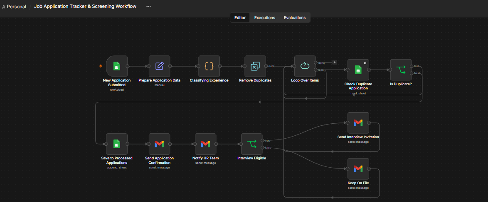
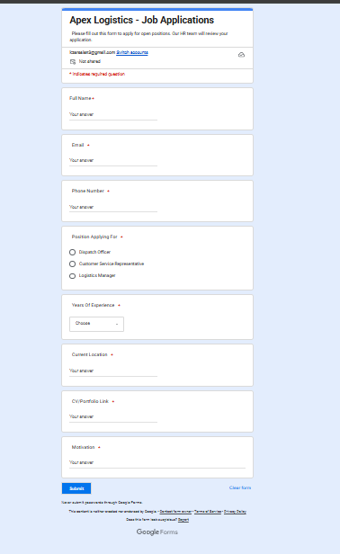
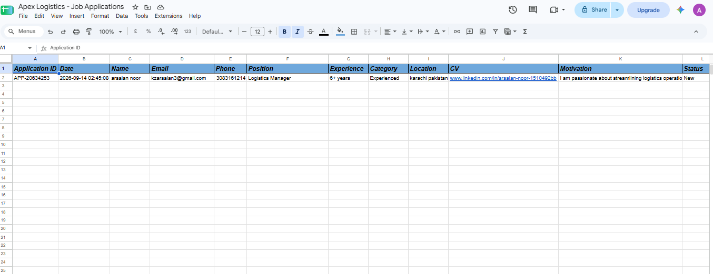

# Job Application Tracker & Screening — n8n Workflow

An automated HR screening workflow built with n8n that ingests candidate responses from Google Forms, automatically classifies experience levels, checks for duplicate applications, logs data into Google Sheets, and sends tailored email communications via Gmail.

---

## What It Does

```text
[ Google Form ] ➔ [ Data Prep ] ➔ [ Experience Classification ]
                                              │
                                              ▼
[ Email Alerts ] ◄─ [ Duplicate Check ] ◄─ [ Data Deduplication ]


---

## Screenshots

### Workflow Architecture


### Google Form & Database Setup



---

## License

MIT — Free to use and customize.


